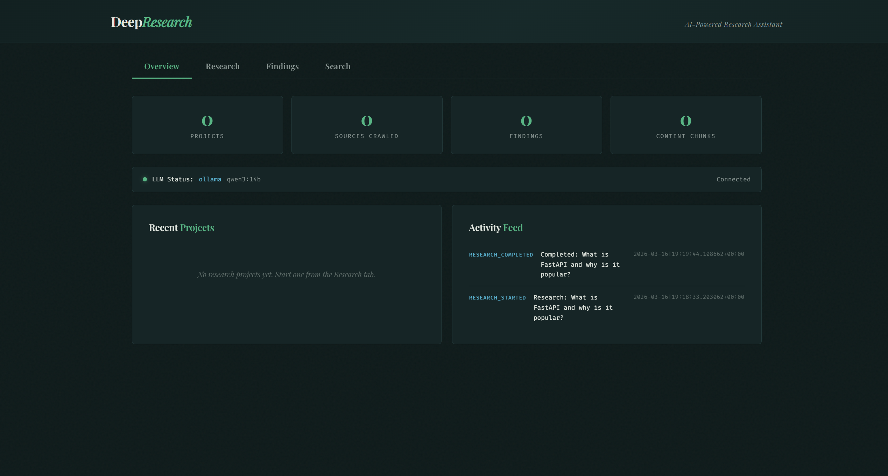

# DeepResearch — AI Research Assistant

[English](README.md) | **Deutsch**

Gib ein Thema ein — DeepResearch crawlt das Web, analysiert Quellen, extrahiert Erkenntnisse und generiert einen strukturierten Forschungsbericht. Alles lokal mit Ollama. Stelle Follow-up-Fragen und es erinnert sich an alles.

**Reines Python + SQLite. 18 Tests. Keine API-Keys noetig.**



## Was es macht

```
Thema -> URLs generieren -> Crawlen -> Chunken -> Indexieren -> Analysieren -> Findings -> Report
                                                                        |
                                                              Follow-up Fragen
```

## Schnellstart

```bash
git clone https://github.com/timmeck/deepresearch.git
cd deepresearch
pip install -r requirements.txt
ollama pull qwen3:14b

python run.py research "Was ist WebAssembly und warum ist es wichtig?"
python run.py show 1
python run.py ask 1 "Wie vergleicht es sich mit JavaScript?"
python run.py serve  # Dashboard -> http://localhost:8400
```

## Support

[](https://github.com/timmeck/deepresearch)
[](https://paypal.me/tmeck86)

---

Gebaut von [Tim Mecklenburg](https://github.com/timmeck)
